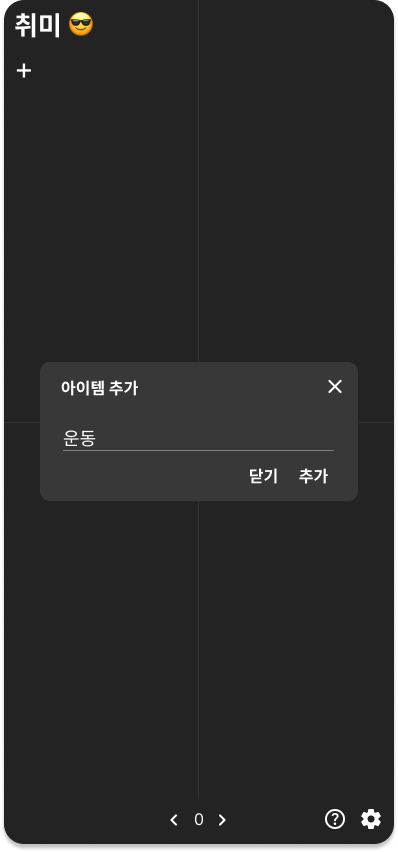
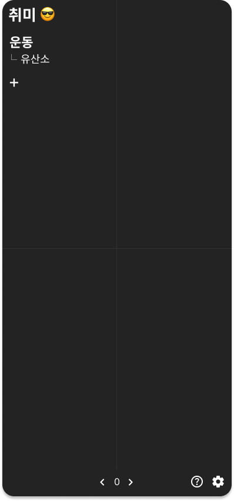
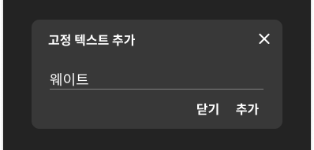
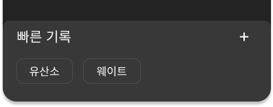
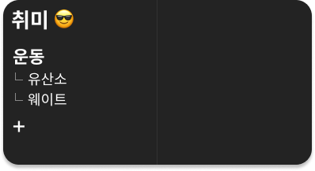

# 소개

**일상에서 반복되는 것들을 간편하게 기록하세요.**

[플레이스토어 링크](https://play.google.com/store/apps/details?id=com.kfstudio.onetouchlife)

|  |  |
| -------------------------------------------------------- | -------------------------------------------------------- |

# 구현 화면

<table>
  <tr>
    <td width="50%"></td>
    <td width="50%"></td>
  </tr>
  <tr>
    <td>메인 화면. 먼저 폴더를 추가한다.</td>
    <td>폴더가 추가 되면 그 안에 아이템을 추가할 수 있다.</td>
  </tr>
  <tr>
    <td></td>
    <td></td>
  </tr>
  <tr>
    <td>‘운동’ 아이템이 추가되었다. 그 아래 ‘유산소’ 라는 버튼을 클릭하여 기록을 추가한다.</td>
    <td>‘운동’을 클릭하면 저장된 기록을 확인할 수 있다.</td>
  </tr>
  <tr>
    <td></td>
    <td></td>
  </tr>
  <tr>
    <td>빠른 기록 버튼을 추가할 수 있다. 사용자가 기록되길 원하는 텍스트를 입력한다. ‘웨이트’라는 버튼을 추가하고 클릭하면 ‘웨이트’가 기록될 것이다.</td>
    <td>추가된 버튼을 확인할 수 있다.</td>
  </tr>
  <tr>
    <td></td>
    <td></td>
  </tr>
  <tr>
    <td>메인 화면에도 추가가 되었다.</td>
    <td></td>
  </tr>
</table>
