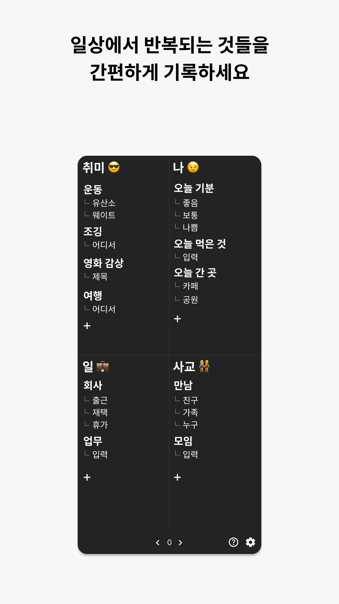
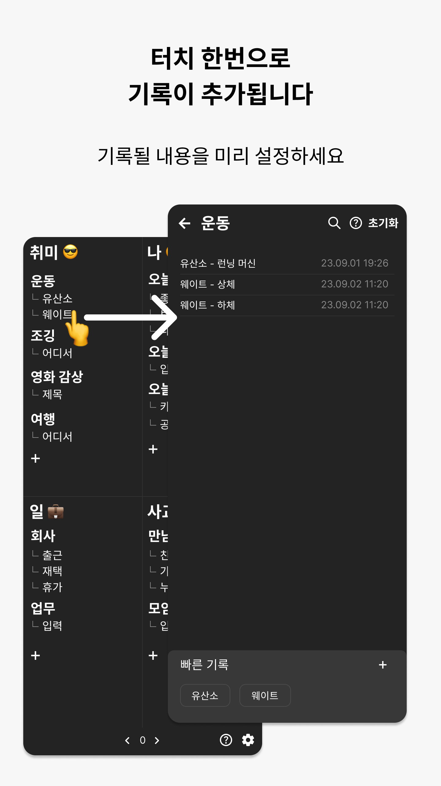
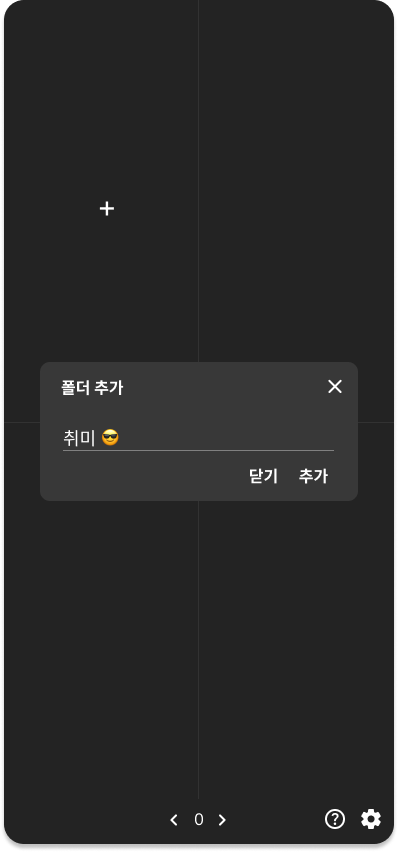
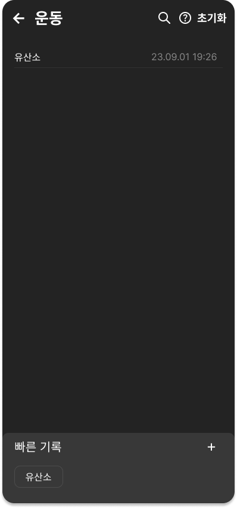

# 소개

**일상에서 반복되는 것들을 간편하게 기록하세요.**

[https://play.google.com/store/apps/details?id=com.kfstudio.onetouchlife](https://play.google.com/store/apps/details?id=com.kfstudio.onetouchlife)

 | 

# 진행 기간

2023.09.09 ~ 2023.10.27

# 프레임워크, 라이브러리

**React Native, Expo**

**Redux toolkit**

**React native navigation**

**Expo SQLite**

# 구현 화면

메인 화면. 먼저 폴더를 추가한다.

.png>)

‘운동’ 아이템이 추가되었다. 그 아래 ‘유산소’ 라는 버튼을 클릭하여 기록을 추가한다.

.png>)

폴더가 추가 되면 그 안에 아이템을 추가할 수 있다.

‘운동’을 클릭하면 저장된 기록을 확인할 수 있다.

.png>)

빠른 기록 버튼을 추가할 수 있다. ‘웨이트’라는 버튼을 추가하면 클릭할 때마다 ‘웨이트’가 기록될 것이다.

.png>)

추가된 버튼을 확인할 수 있다.

.png>)

메인 화면에도 추가가 되었다.
